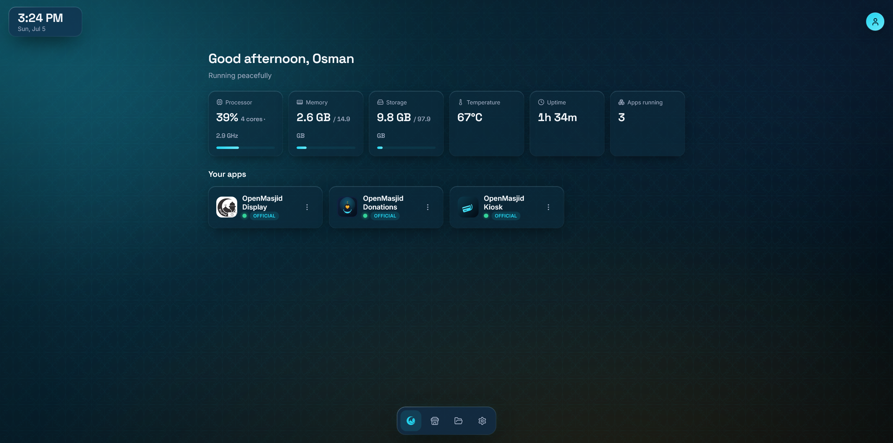
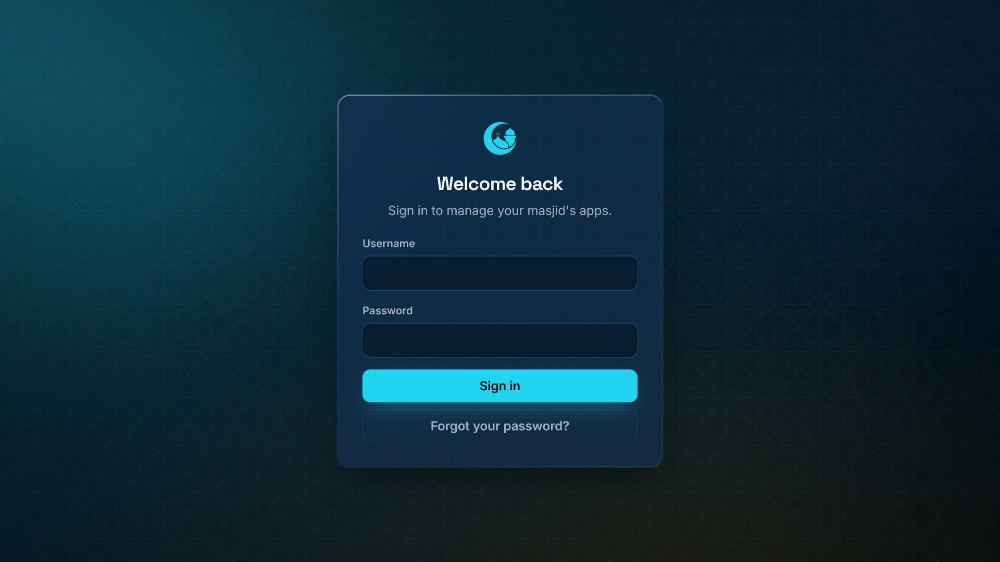
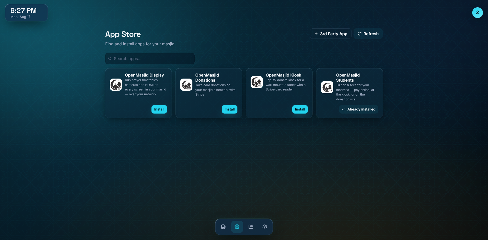
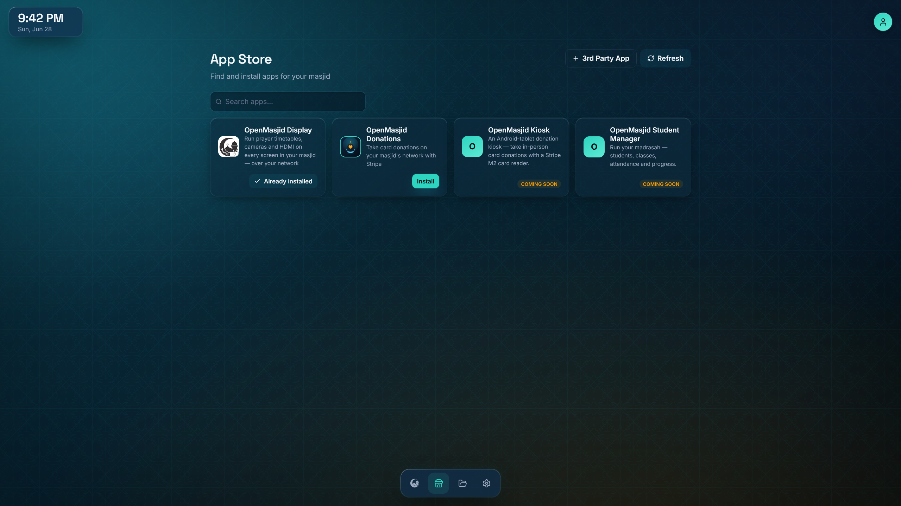
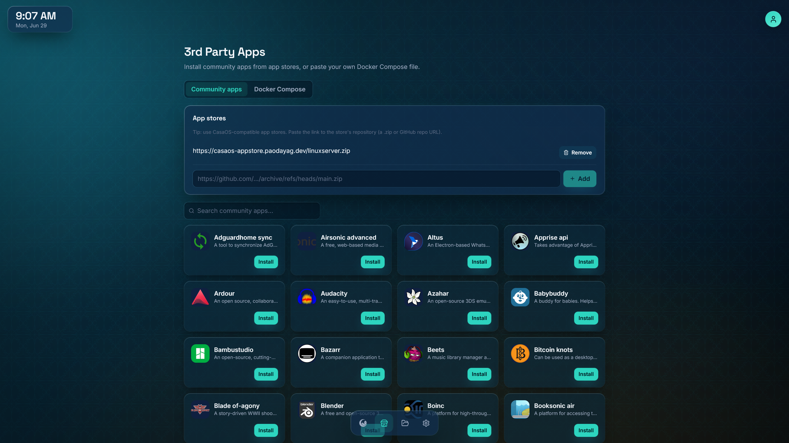
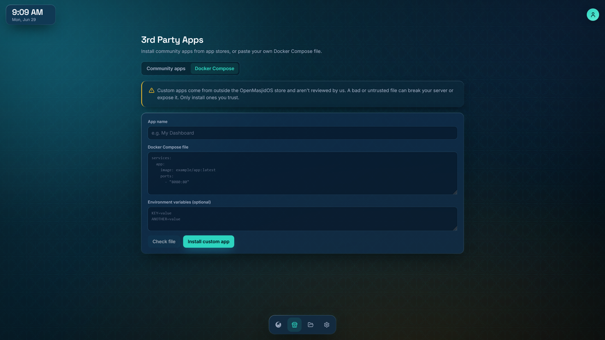
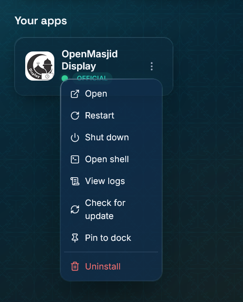
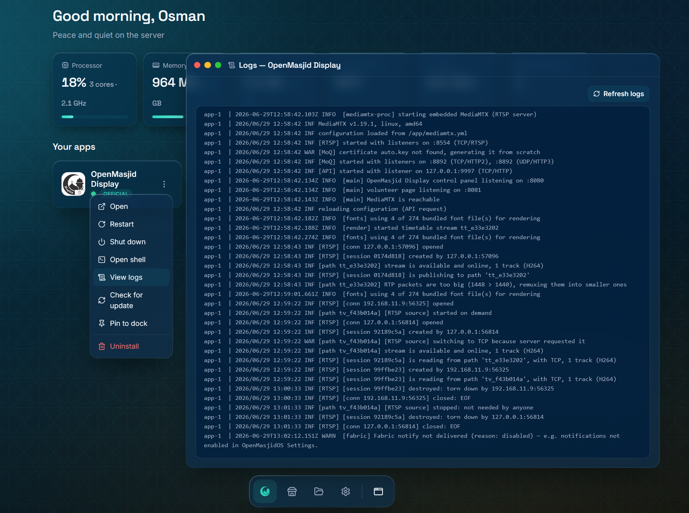
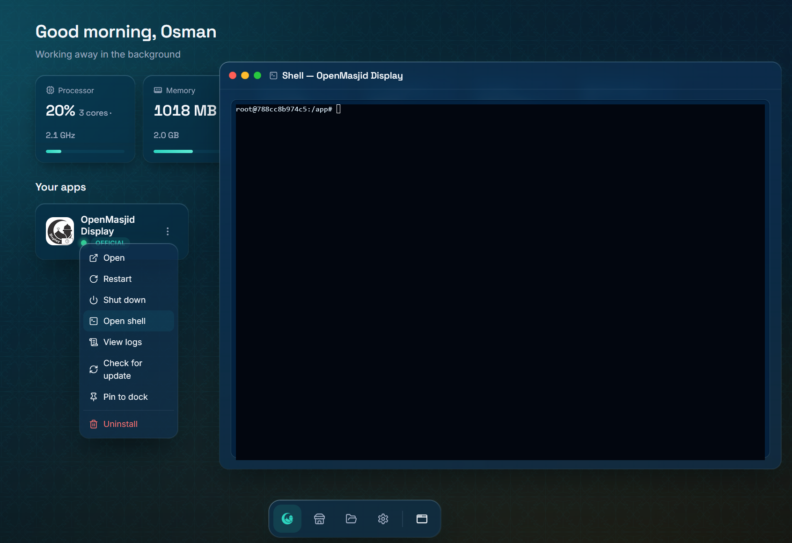
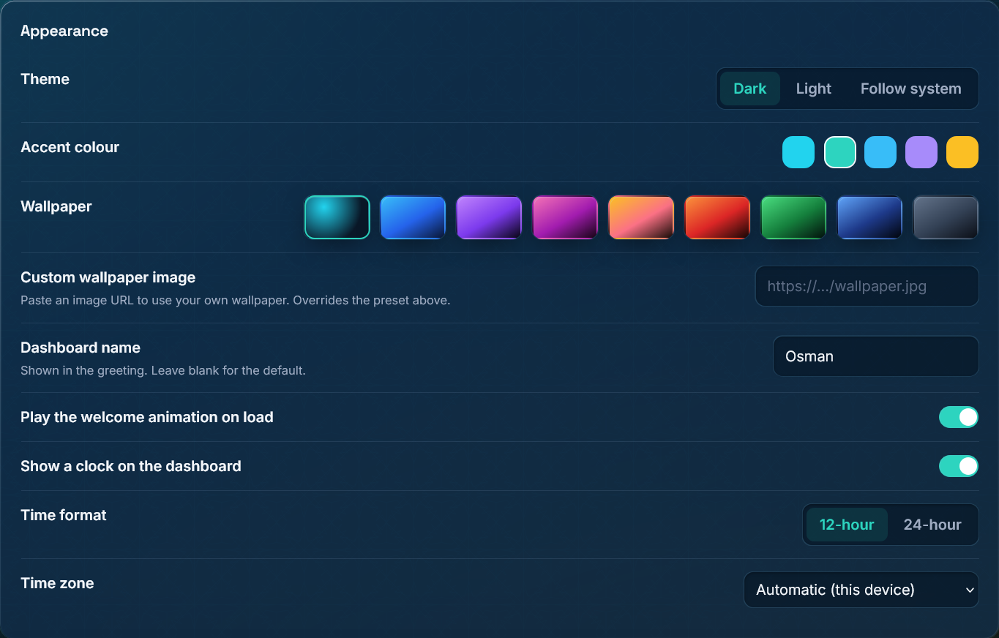

<p align="center">
  <a href="https://openmasjidsolutions.org">
    
  </a>
</p>

<h1 align="center"><b>OpenMasjidOS</b></h1>

<p align="center">
  <a href="#a-look-inside">A look inside</a> |
  <a href="#install">Install Guide</a> |
  <a href="#license">License</a>
</p>

<div align="center">
  <a href="https://github.com/OpenMasjid-Solutions/OpenMasjidOS/releases">
    
  </a>
  <a href="https://github.com/OpenMasjid-Solutions/OpenMasjidOS">
    
  </a>
  <a href="https://discord.gg/MpPDbyQfaF">
    
  </a>
</div>

<h5 align="center">
Leave a star if you like the project! ⭐️
</h5>

> **Free, open-source software platform for masjids.** Install in one command. Manage everything from a beautiful web dashboard. No technical knowledge required.

```bash
bash -c "$(curl -fsSL https://raw.githubusercontent.com/OpenMasjid-Solutions/OpenMasjidOS/master/install.sh || wget -qO- https://raw.githubusercontent.com/OpenMasjid-Solutions/OpenMasjidOS/master/install.sh)"
```

(Works whether your system has `curl` or `wget` — no need to install one first; the installer sets up `curl` for you.) When it finishes, open **`http://<your-server-ip>`** on the same network and create your admin account.

**Think of it as umbrelOS, but built for masjids** — it runs on your own hardware (a Raspberry Pi, a mini-PC, or a Proxmox server), entirely under your control. No subscriptions, no cloud, no data sharing.

---

## Acknowledgements

Created by **Hasan Ismail**, with immense help from **Qari Ijaz** and **Osman Sayed**.

<div align="center">
  <table>
    <tr>
      <td align="center">
        <a href="https://github.com/hasan-ismail">
          <br />
          <sub><b>Hasan Ismail</b></sub>
        </a>
      </td>
      <td align="center">
        <a href="https://github.com/ijazshare">
          <br />
          <sub><b>Qari Ijaz</b></sub>
        </a>
      </td>
      <td align="center">
        <a href="https://github.com/osayed0001">
          <br />
          <sub><b>Osman Sayed</b></sub>
        </a>
      </td>
    </tr>
  </table>
</div>

Resources for this project were generously sponsored by **[An-Noor Institute](https://www.annoorusa.org/)**, **[Rihlatul Ilm Foundation](https://rifusa.org/)**, and **[AsmaTec Inc.](https://asmatec.com/)**.

<div align="center">
  <table>
    <tr>
      <td align="center">
        <a href="https://www.annoorusa.org/">
          <br />
          <sub><b>An-Noor Institute</b></sub>
        </a>
      </td>
      <td align="center">
        <a href="https://rifusa.org/">
          <br />
          <sub><b>Rihlatul Ilm Foundation</b></sub>
        </a>
      </td>
      <td align="center">
        <a href="https://asmatec.com/">
          <br />
          <sub><b>AsmaTec Inc.</b></sub>
        </a>
      </td>
    </tr>
  </table>
</div>

May Allah reward everyone who made it possible.

---

## A look inside

<p align="center"></p>
<p align="center"><sub>The dashboard for the example masjid, <b>An-Noor Institute</b> — live CPU, memory, storage, temperature and uptime above your apps, on a custom wallpaper.</sub></p>

<table>
  <tr>
    <td width="50%"><br><sub><b>Always behind a login.</b> First run creates your admin account.</sub></td>
    <td width="50%"><br><sub><b>App Store.</b> Browse the catalog and install with one click.</sub></td>
  </tr>
  <tr>
    <td width="50%"><br><sub><b>One-click install.</b> Each app collects the details it needs up front.</sub></td>
    <td width="50%"><br><sub><b>Community stores.</b> Add CasaOS-compatible repositories (advanced, opt-in).</sub></td>
  </tr>
  <tr>
    <td width="50%"><br><sub><b>Bring your own app.</b> Paste a Docker Compose file, risk-checked first.</sub></td>
    <td width="50%"><br><sub><b>Your apps, your way.</b> Open, restart, shut down, pin, or remove.</sub></td>
  </tr>
  <tr>
    <td width="50%"><br><sub><b>Live logs</b> in a draggable, macOS-style window.</sub></td>
    <td width="50%"><br><sub><b>A terminal</b> into any app, or into the platform itself.</sub></td>
  </tr>
  <tr>
    <td width="50%"><br><sub><b>File manager.</b> Browse, upload, download — drag &amp; drop included.</sub></td>
    <td width="50%"><br><sub><b>Edit &amp; view files</b> — text, images and video, in a window.</sub></td>
  </tr>
  <tr>
    <td width="50%"><br><sub><b>Make it yours.</b> Theme, accent, wallpaper, clock, and more.</sub></td>
    <td width="50%"><br><sub><b>Light or dark.</b> Both first-class; dark is the default.</sub></td>
  </tr>
</table>

---

## What it does

Everything lives behind a login on a single, polished dashboard.

### Your apps

- **An App Store** — browse the [OpenMasjidAPPS](https://github.com/OpenMasjid-Solutions/OpenMasjidAPPS) catalog and install with one click. Each app collects the details it needs (location, prayer-calculation method, etc.) at install time, so the platform itself stays generic and holds no masjid data.
- **Full app control** — open, restart, shut down, update, or remove any app; pin favourites to the dock; watch live logs in a draggable window.
- **Port conflicts handled for you** — if an app wants a port something else is using, you're offered a free one instead of a failed install.
- **Every app is its own isolated Docker container**, so **updating OpenMasjidOS never touches your apps or their data.**

### Keeping it up to date

- **One-click updates** for the platform, from the dashboard — it pulls the new version, restarts itself, and reconnects the page automatically. No terminal.
- **Update channels** — choose **Stable** (tested, the default) or **Development** (what we're still building). The choice covers OpenMasjidOS, the App Store and every app together, so you're never running a mix. Switching is confirmed in both directions, and coming back to Stable warns you first, because Development can move ahead in ways that don't reverse cleanly.
- **What's new** — release notes in the dashboard, straight from the account menu, so you can see what changed without leaving for GitHub.
- **Update alerts** — you're told when a new version of the platform or any app is available.

### Staying informed

- **Live system status** — CPU, memory, storage, temperature, uptime and apps running, streaming in real time.
- **Email** — configure SMTP or Resend once, send yourself a test, and apps can send mail through it without ever handling your credentials.
- **Notifications** — one webhook for Slack, Discord or anything generic.
- **A granular alert matrix** — every alert type, from the platform and from each app, routed per-channel: email, webhook, both or off. Built-in alerts cover an app going offline, updates being available, and **card payments being disputed** (chargebacks — the platform polls Stripe and tells you the amount, the reason and the deadline, because an unanswered dispute is lost by default).

### Money, safely

- **A Stripe vault** — save your keys once and let several apps share one account. The secret keys never leave the server and are never returned to the browser.
- **Chargeback monitoring** — see above. The platform creates no charges and moves no money; it stays payment-agnostic.

### Reaching it

- **Forced HTTPS** — the dashboard is served over TLS with a self-signed certificate generated on first boot, or bring your own. A damaged certificate can't stop the box starting: it's replaced automatically and the dashboard stays reachable.
- **`openmasjidos.local`** — mDNS so you don't need to remember an IP, plus an optional static IP set up by the installer.
- **Remote access** — an optional Cloudflare Tunnel publishes chosen apps on your own domain. **Per-app and off by default**, and the admin dashboard itself is never exposed.
- **Follows the box** — move the machine to a different network and your apps find the dashboard again by themselves.

### Files and the machine

- **A built-in file manager** — browse, upload (drag & drop), download, rename, edit text, and preview images and video. OpenMasjidOS's own settings and keys are kept private and can't be opened or changed from here.
- **Backups** — download everything (settings and app data) as one archive, or schedule off-site backups to Google Drive, SFTP, SMB or WebDAV with automatic pruning. Restore from the login screen when moving to a new machine.
- **Housekeeping** — reclaim disk space from unused images, and reboot the server, from the dashboard.

### Making it yours

- **Dark or light**, accent colours, wallpapers (or your own image), a glass clock and tasteful motion — with `prefers-reduced-motion` respected.
- **Your masjid's logo** — appears on the emails OpenMasjidOS sends and on your notification messages, and apps can use it to brand their own pages.
- **Right-to-left and translation-ready** — every string goes through i18next.

### The OpenMasjidOS Fabric

- Apps can inherit the dashboard's theme, wallpaper and logo, and — when they opt in — **share its login**, so opening one feels like part of the dashboard.
- Apps can **securely ask each other** for information through a broker that only permits pairings both sides declared.
- Apps can send email and raise alerts through the platform **without ever seeing a credential**.
- All of it is LAN-only, least-privilege, and authenticated with a per-app key. It never shares masjid data.

### Advanced (opt-in, off by default)

- **Community app stores** — add CasaOS-compatible repositories by URL.
- **Paste a Docker Compose file** to run any container, risk-checked before it starts.
- **Terminals** — a shell into any app, or into the platform itself.
- **SSH key access** to the host.

> **On safety:** every app — from the store, from a community repo, or pasted in — passes the same install-time risk check, and it runs again on update and after a restore. Anything that would reach the platform's own state or another app's data is refused outright.

---

## Install

| | Minimum | Recommended |
|---|---|---|
| **CPU** | 4 Cores | 8 Cores |
| **RAM** | 4 GB | 8 GB |
| **Storage** | 8 GB free | 32 GB |

Docker is installed automatically if it isn't already present. The installer detects your OS/architecture, creates `/opt/openmasjid/` for all data, starts the core as a service that survives reboots, and prints your access URL.

On most Linux machines (Ubuntu 20.04+/Debian 11+/Raspberry Pi OS 64-bit/Fedora/Rocky/Alma), just SSH in and run the one-liner at the top. Detailed, copy-paste guides for specific setups:

<details>
<summary><b>Raspberry Pi (Ubuntu Server 22.04 LTS)</b></summary>

A Pi 4/5 runs OpenMasjidOS silently 24/7. Use **Raspberry Pi Imager** ([raspberrypi.com/software](https://www.raspberrypi.com/software/)) to flash **Ubuntu Server 22.04 LTS (64-bit)**. In the gear/Advanced settings before writing: set hostname `openmasjid`, enable SSH (password auth), set username/password, configure Wi-Fi only if you have no ethernet, and set your timezone.

Boot the Pi (ethernet recommended), wait ~90 seconds, then:

```bash
ssh openmasjid@openmasjid.local
sudo apt update && sudo apt upgrade -y && sudo apt install -y curl
curl -fsSL https://raw.githubusercontent.com/OpenMasjid-Solutions/OpenMasjidOS/master/install.sh | bash
```

Open the Pi's IP. For a stable address, add a DHCP reservation in your router.
</details>

<details>
<summary><b>Proxmox VE (LXC container)</b></summary>

From the Proxmox node **Shell**, run the Community Scripts **All Templates** helper:

```bash
bash -c "$(curl -fsSL https://raw.githubusercontent.com/community-scripts/ProxmoxVE/main/tools/addon/all-templates.sh)"
```

From the menu:

- Select **debian-12-standard** (RECOMMENDED)
- or any other template of choice

When provisioning completes, **copy the generated root password** displayed by the script.

## First Login

Open the container **Console** in Proxmox and log in as:

- **Username:** `root`
- **Password:** *(the password generated by the helper script)*

Immediately change the password:

```bash
passwd
```

## Install OpenMasjidOS

Run the one-liner at the top.

When installation completes, open: `http://<container-ip>`
</details>

<details>
<summary><b>Bare-metal Linux (mini-PC, old laptop, server)</b></summary>

SSH in with a `sudo`-capable account (or as root) and run the one-liner at the top. Verify with:

```bash
sudo docker ps   # look for "openmasjid-core", status "Up ..."
```
</details>

---

## Day-to-day

- **First run** — create an admin account: your name, an email, and a password (12+ chars). You sign in with the name; the email is only where OpenMasjidOS sends alerts. That is the whole setup — you go straight to the dashboard. Prayer times and location are collected by each app, never by the platform.
- **Manage** — run the same install command again for a menu: **Update** (latest version, apps/data untouched), **Repair** (re-apply config and restart), **Reconfigure network**, or **Uninstall**. Update/Repair only ever touch the core, never your apps.
- **Update from the dashboard** — Settings → Advanced → Check for updates → Update now, with live progress. No terminal needed.
- **Choose your channel** — Settings → Advanced → Update channel. **Stable** is tested and is what you get by default; **Development** is what we are still building and can break your apps. It covers the platform and all your apps together.
- **Reset the admin password** (from the machine's terminal — no data lost):
  ```bash
  docker exec -it openmasjid-core node packages/core/dist/reset-password.js
  ```
- **Backups** — Settings → Advanced → Download a backup (or restore one), or schedule off-site backups to Google Drive, SFTP, SMB or WebDAV. Everything lives under `/opt/openmasjid/` (`config/` = settings + hashed admin account, `apps/<id>/` = each app's compose/env/data).

---

## Apps

Each app lives in its **own** repository and is catalogued by **[OpenMasjidAPPS](https://github.com/OpenMasjid-Solutions/OpenMasjidAPPS)**, which OpenMasjidOS fetches to populate the App Store and to handle install, update, and removal. Advanced users can also add CasaOS-compatible community stores or paste a Docker Compose file (enable *Allow custom apps* in Settings → Advanced). To build an app, start with [OpenMasjidAPPS](https://github.com/OpenMasjid-Solutions/OpenMasjidAPPS) (its `CLAUDE.md` + `docs/BUILDING_AN_APP.md`); the platform-side contract is in [`docs/APP_MANIFEST_SPEC.md`](docs/APP_MANIFEST_SPEC.md).

---

## Development

TypeScript monorepo (npm workspaces): a Node + Fastify + tRPC daemon (`packages/core`) and a React + Vite + Tailwind dashboard (`packages/ui`). Requires Node 20+ and Docker.

```bash
git clone https://github.com/OpenMasjid-Solutions/OpenMasjidOS.git && cd OpenMasjidOS
npm install     # install all workspaces
npm run dev     # daemon + UI with hot reload (UI at http://localhost:5173)
npm run build   # build UI + bundle daemon
npm run image   # build & tag the runtime Docker image
```

In production the dashboard is served over **HTTPS on 443**, with a plain-HTTP front door on **80** that redirects browsers and keeps the app-facing API reachable. In dev the daemon uses **8723** with the Vite dev server on **5173** (proxying `/trpc` and `/api`). See [`docs/ARCHITECTURE.md`](docs/ARCHITECTURE.md).

```bash
npm run lint    # typecheck both workspaces
npm run test    # the test suite
```

### Branches

| Branch | Role |
|--------|------|
| **`master`** | Stable / release. What masjids run. Updated only at release time. |
| **`dev`** | Active development. **Open pull requests against `dev`.** |

`dev` is also the **Development** update channel: pushes there publish a `:dev` image that boxes on that channel pull. `master` publishes `:latest`. Full policy in [`CLAUDE.md`](CLAUDE.md#branching-policy).

---

## License

GNU Affero General Public License v3.0 (AGPL-3.0) — see [LICENSE](LICENSE). You're free to use, modify, and distribute it; if you deploy a modified version as a network service, you must publish your modified source under the same license, so improvements by one masjid benefit all masjids.

**Contributing:** contributions are made under AGPL-3.0 and a **Contributor License Agreement** ([CLA.md](CLA.md)) that lets the project also offer commercial/dual licenses to organisations that can't accept AGPL — the public tree always stays AGPL-3.0. The CLA is signed automatically on your first pull request. See [CONTRIBUTING.md](CONTRIBUTING.md).
